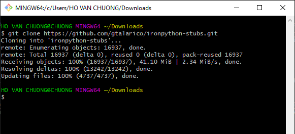
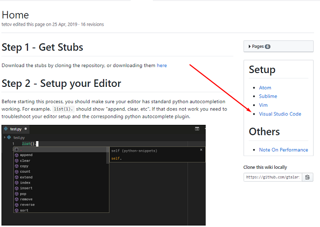

Chào mừng các bác đã ghé thăm blog của mình.😄

---
### IDE hỗ trợ

<a href="https://atom.io/" target="_blank">Atom</a>, <a href="https://www.sublimetext.com/" target="_blank">Sublime</a> và <a href="https://code.visualstudio.com/" target="_blank">Visual Studio Code</a> | <a href="https://www.jetbrains.com/pycharm/" target="_blank">Pycharm</a> cũng không ngoại lệ vì `IronPython Stubs` tiền thân được tạo từ Pycharm. Tiền thân của dự án này được tìm thấy ở [đây](https://gitlab.com/reje/revit-python-stubs).Cũng may mà tác giả <a href="https://github.com/gtalarico" target="_blank">gtalarico</a> đã cải tiến và giúp các dev như mình có cái mà dùng như hiện tại.

### Tại sao lại là IronPython Stubs ?

Đơn giản là khi mình **import** thư viện Common Language Runtime (clr) vào thì các công cụ IDE thông thường không thể nào truy cập được các modul bên trong nó như khi ta add reference xong import modul là có gợi ý mã tự động luôn trong Visual Studio đâu, cũng chính vì lí do đó và một phần lập trình viết nhiều sẽ gây làm biến, làm biến rồi thì phát sinh ra tự động hoàn thành thôi, và thế là công cụ ra đời 😁, mình chém gió thế thôi chứ biết đâu ý của tác giả cũng như mình thì sao ! 

Dùng cái này cũng tiện cho mình gõ chữ vì các method thì có tên viết hoa tên không hoặc tên dài lòn thòn gõ đi gõ lại cũng bấy nhiêu mà hiệu suất thì lại không nhanh bằng **AutoComplete**.

Vậy thì công việc của mình chỉ là cần kéo gói này về trên **github** về và sử dụng thôi, mình thì thường sử dụng <a href="https://code.visualstudio.com/" target="_blank">Visual Studio Code</a> quen rồi nên chiến luôn.Mình khuyên các bác cũng nên sử dụng IDE này vì cũng sịn phết, tiện tích quá trời mà lại của cha Microsoft nữa nên không lo vụ bỏ con giữa chợ đâu. 😍

### Cài đặt IronPython Stubs

Đầu tiên là mình clone cái kho **github** chứa cái đó đã nó được tìm thấy ở <a href="(https://github.com/gtalarico/ironpython-stubs/archive/master.zip" target="_blank">đây</a> nếu các bác muốn click phát tải ngay.Nếu là người sử dụng git chuyên clone về rồi thì đi đến thẳng kho Github <a href="https://github.com/gtalarico/ironpython-stubs" target="_blank">này</a> rồi kéo về luôn.Giành cho bác nào chưa biết sài git thì ghé chỗ [này](https://rogerdudler.github.io/git-guide/index.vi.html) ngó sơ qua cũng không khó là mấy, vòng vòng cũng chỉ là vài lệnh cơ bản.



Kéo về được rồi thì làm sao nữa, tất nhiên là trên máy các bác phải có IDE rồi, như trên đầu mình đã nói những IDE nào sẽ được hỗ trợ, các bác lựa cho mình một IDE thích thú rồi bế em nó về máy thôi.Cài đặt với vài cái next next là xong.

Tiếp theo là các bác vào <a href="https://github.com/gtalarico/ironpython-stubs/wiki" target="_blank">đây</a>  , tích vào <a href="https://www.codehub.vn/IDE-La-Gi" target="_blank">IDE</a>  nào mình đã cài và xem hướng dẫn.



Ở bài này mình sẽ hướng dẫn cho **Visual Sudio Code** thôi nhé vì mình đang sài mỗi em nó.Các bác chỉ việc gõ tổ hợp phím` Crt+Shift+P `vào phần **OpenSetting**(Json) dán thêm đoạn này vào : 

```
//Python
    "python.linting.enabled": false,
    "python.linting.pep8Enabled": false,
    "python.pythonPath": "C:\\Program Files\\Python27\\python.exe",
    "python.autoComplete.extraPaths": ["C:\\Users\\erfajo\\.vscode\\stubs.min"],
    "python.autoComplete.preloadModules": [
        "Autodesk.Revit.DB",
        "Autodesk.Revit.UI"
    ] 

```
Các bác thấy đó , chỗ `pythonPath` Các bác sẽ thay đổi đường dẫn thành nơi mà <a href="https://www.python.org/downloads/" target="_blank">Python</a> được cài đặt, còn `extraPaths` thì các bác sửa lại thành chỗ đường dẫn mà mình đã tải cái kho phía trên.Giờ mình mở lên xem đường dẫn ở đâu và dẫn nó đến `stubs.min` như cái mình đã làm mẫu cho các bác bên trên đó.

Cuối cùng thì mình cũng nên khởi động lại cái máy một xíu rồi hóng thành quả nào 😁


Nếu vẫn chưa làm được thì không sao hết tác giả cũng rất có tâm làm luôn video hướng dẫn cho mình tại <a href="https://www.loom.com/share/72588e78e6cc4d65a8a294b84ed2dee1" target="_blank">đây</a>.

Nếu các bác vẫn đen quá thì có thể để lại lời cầu cứu bên dưới cho mình , mình sẽ giúp đỡ.Hi vọng là các bác không đen đến thế đâu, cũng đơn giản thôi mà 😍

### Tổng kết

Vậy là mình đã kể cho các bác nghe xong hết câu chuyện nữa rồi đó, cứ thấy gì đó vui vui hay hay là mình lại viết lên cho a e tham khảo và góp ý, nếu có ý tưởng gì giúp cải thiện nhanh hơn thì các bác bình luận bên dưới nhé, mình sẽ bổ sung để bài viết được hoàn thiện hơn.Cám ơn các bác đã ghé thăm blog của mình !

### Tham khảo :
<a href="https://forum.dynamobim.com/t/python-autocomplete/12671" target="_blank">Dyanmo Forum</a>  
<a href="https://github.com/gtalarico/ironpython-stubs" target="_blank">Github</a>  
<a href="https://github.com/gtalarico/ironpython-stubs/wiki" target="_blank">Wiki</a>
<a href="https://docs.google.com/document/d/1ETrqpYOV4N57Ro7ghOMc66LSL7EB1O2Qy-fXiQ4YLGM/edit#heading=h.30nohwaik92" target="_blank">Pycharm</a>
