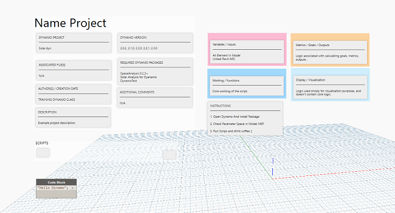

Chào mừng các bác đã ghé thăm blog của mình.😄

### Tại sao lại có chia sẻ này ?

Mình ngó sơ qua các bài của mọi người gửi cho mình trợ giúp đều không có, vì đa số viết chạy một lần.Nhưng với cách trình bày này, mình có thể lưu trữ lại sử dụng và gợi nhớ lâu hơn, người khác nhìn vào cũng cảm tháy chuyên nghiệp, người sử dụng cũng dễ dàng nắm bắt và sử dụng tệp không phải do họ tạo ra.
 

---
### Tải xuống

Hình ảnh xem trước 

Liên kết tải xuống : [Here](http://www.mediafire.com/file/edqxb8ymthuhazi/Template.dyn/file)

### Tổng kết

Vậy là mình đã kể cho các bác nghe xong hết câu chuyện nữa rồi đó, cứ thấy gì đó vui vui hay hay là mình lại viết lên cho a e tham khảo và góp ý, nếu có ý tưởng gì giúp cải thiện nhanh hơn thì các bác bình luận bên dưới nhé, mình sẽ bổ sung để bài viết được hoàn thiện hơn.Cám ơn các bác đã ghé thăm blog của mình !

### Tham khảo :
Hồ Văn Chương
