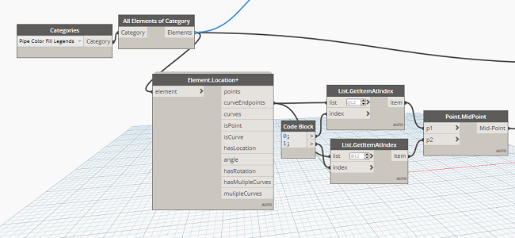
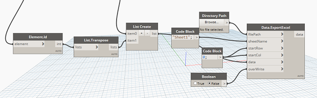
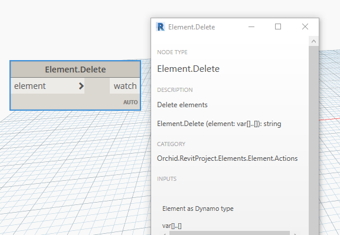

Chào mừng các bác đã ghé thăm blog của mình.😄

### Mục đích sử dụng

Đôi khi việc sao chép hoặc dán đối tượng trong mô hình làm ảnh hưởng đến công việc này, vấn đề có thể xảy ra rất nhiều với trường hợp sao chép nhầm mà khó có thể nhận ra được đối tượng nào trùng lặp, với Scripts nhỏ dưới này sẽ giúp bạn kiểm tra nhanh những ống nào nằm trong mô hình MEP bị trùng lặp nhé.
 

---
### Bắt đầu
Đầu tiên mình sẽ lấy về các ống Pipe có trên mô hình và các đường CurveEndpoints để lấy MidPoint lọc ra một mớ list tọa độ của các ống.Giờ thì công việc tiếp theo của mình chính là tìm ra điểm nào trùng mà thôi.



Thuật toán lọc ra đối tượng trùng lặp 

```
#Cái mớ thư viện mình biến xóa nên để cho ngầy vậy thôi :))
import clr
clr.AddReference('ProtoGeometry')
from Autodesk.DesignScript.Geometry import *

# Import DocumentManager and TransactionManager
clr.AddReference("RevitServices")
import RevitServices
from RevitServices.Persistence import DocumentManager
from RevitServices.Transactions import TransactionManager

# Import RevitAPI
clr.AddReference("RevitAPI")
import Autodesk
from Autodesk.Revit.DB import *

doc = DocumentManager.Instance.CurrentDBDocument
uiapp = DocumentManager.Instance.CurrentUIApplication
app = uiapp.Application

from System.Collections.Generic import *

# Import ToDSType(bool) extension method
clr.AddReference("RevitNodes")
import Revit
clr.ImportExtensions(Revit.Elements)

#Thuật toán chính là ở đây nè :D 

#The inputs to this node will be stored as a list in the IN variable.
dataEnteringNode = IN
mylist = IN[0]

i, seen, result = mylist, set(), []
for _index, item in enumerate(i):
    if item not in seen:
		# First time seeing the element
        seen.add(item)
    else:
		 # Already seen, add the index to the result
        result.append(_index)     

#Assign your output to the OUT variable
OUT = result
```

Giờ thêm tí muối vào để xuất Excel nữa 



Và xóa đối tượng với package Orichid




### Kết quả
Video Demo : <a href="https://www.youtube.com/watch?v=P8UCJhi3ONU" target="_blank">Here</a>  


### Mở rộng 

Ở bài này mình chỉ hướng dẫn các bác làm với các loại như ống có CurveEndPoint, vậy với các Famiy không có CurveEndPoint thì sao, gợi ý cho các bác là dùng `FamilyInstance.Location ` nhé, cuối cùng mình gửi các bác Scrip cho bác nào còn chưa làm được.Chúc các bác thành công.

Picture : <a href="pic/ElementDuplicate.png" target="_blank">Here</a>  
Scripts Dyn : <a href="data/Fix Element Pipe Duplicate.dyn" target="_blank">Here</a>  

### Tổng kết

Vậy là mình đã kể cho các bác nghe xong hết câu chuyện nữa rồi đó, cứ thấy gì đó vui vui hay hay là mình lại viết lên cho a e tham khảo và góp ý, nếu có ý tưởng gì giúp cải thiện nhanh hơn thì các bác bình luận bên dưới nhé, mình sẽ bổ sung để bài viết được hoàn thiện hơn.Cám ơn các bác đã ghé thăm blog của mình !

### Tham khảo :
Hồ Văn Chương