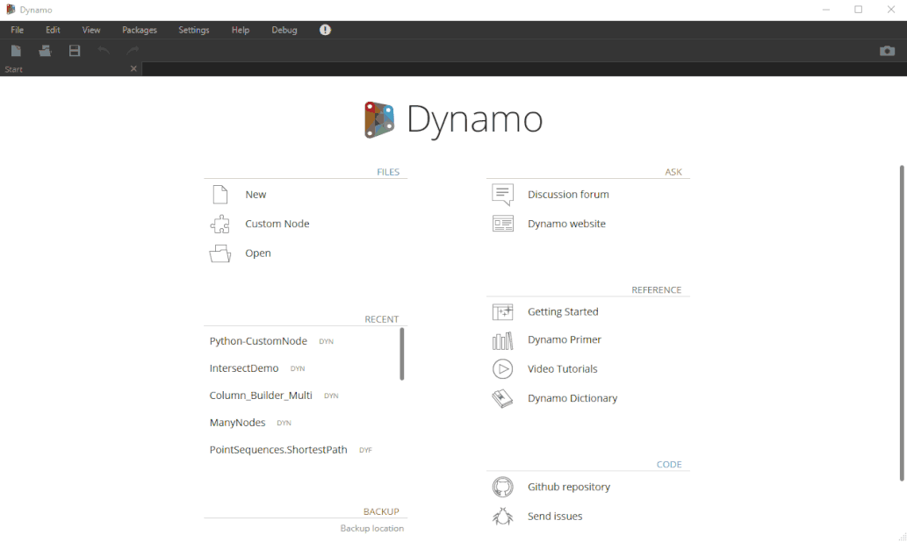

Chào mừng các bác đã ghé thăm blog của mình.😄

### Mục đích sử dụng

- Sắp xếp lại dock cho Pythonscrtips mà trước giờ các phần mềm khác rất phổ biến, và đây cũng là một tính năng beta mà tác giả mới đề cập gần đây.

 

### Tổng kết

Vậy là mình đã kể cho các bác nghe xong hết câu chuyện nữa rồi đó, cứ thấy gì đó vui vui hay hay là mình lại viết lên cho a e tham khảo và góp ý, nếu có ý tưởng gì giúp cải thiện nhanh hơn thì các bác bình luận bên dưới nhé, mình sẽ bổ sung để bài viết được hoàn thiện hơn.Cám ơn các bác đã ghé thăm blog của mình !

### Tham khảo :
<a href="https://forum.dynamobim.com/t/call-for-feedback-on-docking-python-editor/47541" target="_blank">Dynamo Team</a> 