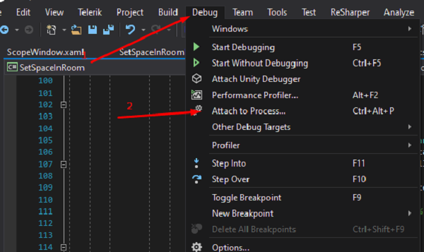
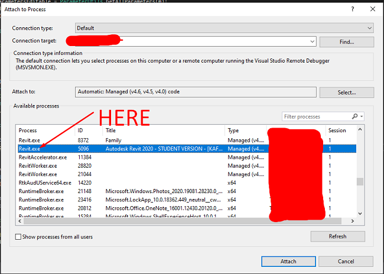
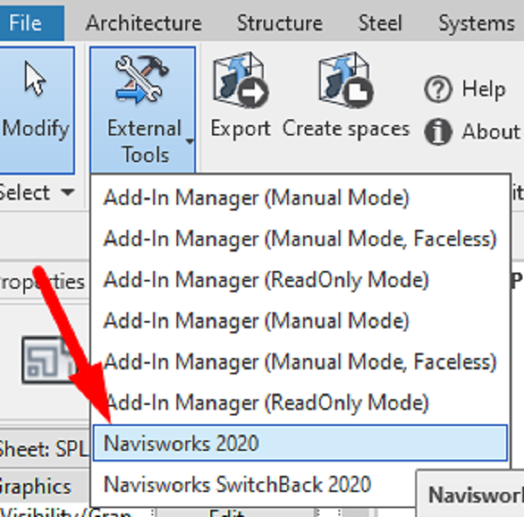

Chào mừng các bác đã ghé thăm blog của mình.😄

### Mục đích 

- Bài viết này giúp các bác lấy ngay tiến trình phần mềm Revit đang mở để gỡ lỗi mà không cần phải khởi động lại phần mềm Revit để Debug, tiết kiệm kha khá thời gian cho gỡ rối mã của mình.Tương tự thì các bác có thể sử dụng cho các phần mềm khác không riêng gì Revit.

### Bắt đầu
Cái mình đang muốn nói đến ở đây chính là tính năng **Attach to Process**

Đầu tiên mình vào Debug/Attach to Process để hiện các ứng dụng đang hoạt động trong tiến trình của Windows đang diễn ra

Lựa chọn Ứng dụng Revit đang mở trên màn hình sử dụng, các vấn đề màu đỏ khác mình che tên để tránh giang hồ nhòm ngó thôi chứ không có gì hết

Tiến hành chạy mã dưới trình command và debug như bình thường

Nếu các bác vẫn còn thấy thắc mắc và chưa làm được thì có thể xem video của tác giả tại <a href="https://www.youtube.com/watch?time_continue=44&v=I3NA2VUB8Hc&feature=emb_logo" target="_blank">Đây</a>  

### Mở rộng 

Ngoài ra có một công cụ còn hay hơn  được tác giả giới thiệu đó là tiện ích **Resurrect** các bác thử tìm hiểu xem sao nhé, rất tiếc là mình không viết ở bài viết này.Mình sẽ để link lại cho bác nào cần tìm hiểu tại <a href="https://marketplace.visualstudio.com/items?itemName=JaroslawWaliszko.Resurrect" target="_blank">Đây</a> 

### Tổng kết

Vậy là mình đã kể cho các bác nghe xong hết câu chuyện nữa rồi đó, cứ thấy gì đó vui vui hay hay là mình lại viết lên cho a e tham khảo và góp ý, nếu có ý tưởng gì giúp cải thiện nhanh hơn thì các bác bình luận bên dưới nhé, mình sẽ bổ sung để bài viết được hoàn thiện hơn.Cám ơn các bác đã ghé thăm blog của mình !
### Tham khảo :
<a href="https://thebuildingcoder.typepad.com/blog/2016/10/ai-edit-and-continue.html#2" target="_blank">The Building Coder</a> 

