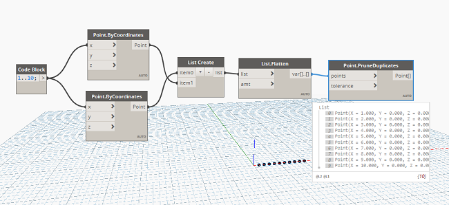
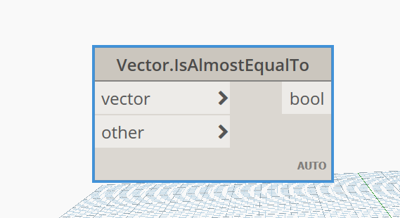

Chào mừng các bác đã ghé thăm blog của mình.😄

### Mục đích 

- Hôm trước có một bác hỏi mình về vấn đề này , đó là tại sao dùng **List.UniqueItems** không thể loại bỏ được các **Point** trùng năm trong **List**, mặc dù nó có loại bỏ.Lý do ở đây là **Point** có một điểm khác **Vector** so với **Point** Còn lại .Vậy thì bây giờ vấn đề sẽ xử lí như thế nào ?

### Cách xử lý

Cách 1 : Duỗi **List** sang **String** với node **StringFromObject** Và sử dụng lại **List.UniqueItems**.Nhưng vấn đề ở đây ta sẽ tốn thêm rất nhiều công đoạn cho xử lý phía sau .Vì vậy cách này rườm rà và không hiệu quả cho lắm.

Cách 2 : Sử dụng node **Point.PruneDuplicates**

Với node này sẽ loại bỏ đi những điểm trùng trong một **List** đưa vào, vấn đề là các bác chưa hề biết đến sự tồn tại của node này mà thôi.

### Mở rộng 

Với dạng Vector các bác có thể tìm hiểu thêm node này để sử dụng :

### Tổng kết
Hôm nay là một ngày đẹp trời, bệnh dịch Corona đang hoành hành, các bác hãy bảo trọng sức khoẻ và tránh ra đường tiếp xúc, rửa tay thường xuyên nhé.Cám ơn các bác đã ghé thăm blog của mình .

