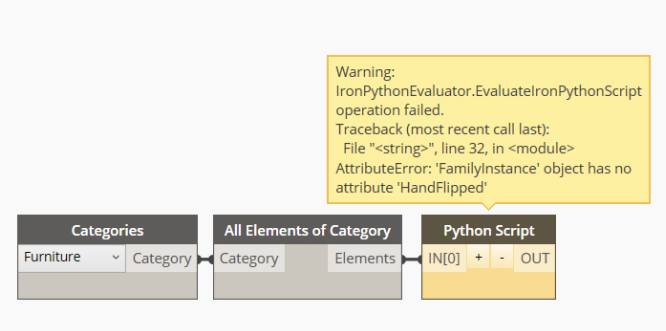

Chào mừng các bác đã ghé thăm blog của mình.😄

### Mục đích

- Bài này được viết ra với mục đích tổng hợp lại các từ khoá mà các anh em hay dùng trung lập trình viết mã với `Python` hoặc `C#`.

### Unwrapping 

Unwrapping : Hiểu đơn giản nhất là gì , chính là đòi em Dynamo mở cái khẩu trang ra cho anh Revit coi mắt và xem được, biết được em nó là con nhà ai, có vợ hay chưa có vợ.Rồi sau đó mới muốn làm gì thì làm.😁

Cú Pháp : 
- Viết với một Funtion để sử dụng lại
```
def Unwrap(item):
    return UnwrapElement(item)
```
- Viết với một dòng đơn
```
Input = UnwrapElement( IN[0] )
```
Lỗi nếu thiếu :
Nếu mình không sử dụng **UnwrapElement** thì đa số là sẽ báo lỗi thiếu thuộc tính, đại loại như thế này :



Ví dụ lấy về type_parameter từ một Đối tượng bên ngoài : 
```
group = UnwrapElement(IN[0])
group_type_id = group.GetTypeId()
group_type = doc.GetElement(group_type_id)
type_parameter = group_type.LookupParameter("Mark")
OUT = type_parameter
```
### Wrapping
Thông thường sẽ có các mã ta hay nhìn thấy như :
- InternalElement  : Hiểu đơn giản là trong lớp Revit.Elements nó đã trả về một **wrapped** trong **Dynamo**, vì vậy ta cần phải chạy lệnh này để có quyền truy cập vào các đối tượng.
- ToDSType(bool) : Để thông báo rằng tui vừa lấy một đối tượng trong revit và quăng vào **Dynamo** đây.Nếu để True thì đồng ý còn ngược lại thì không .

Ví dụ về lấy ElementId :
```
/// <summary>
        /// 
        /// </summary>
        /// <param name="element"></param>
        /// <returns></returns>
        public static ElementId GetId(Element element)
        {
            Autodesk.Revit.DB.Element UnwrapElement = element.InternalElement;

            ElementId unWrapElementId = UnwrapElement.Id;
            return unWrapElementId;
        }

```

Ví dụ tạo tường :
```
 var walls = new List<Revit.Elements.Wall>();
  //elements creation and modification has to be inside of a transaction
  TransactionManager.Instance.EnsureInTransaction(Document);
  foreach (var curve in lines)
  {
    // use the Revit Wall.Create API to make a new wall element
      var wall = Autodesk.Revit.DB.Wall.Create(
        Document, // note the required reference to the Revid Document
        curve.ToRevitType(), // also note we need to convert Dynamo curves to Revit types
        wallType.InternalElement.Id, // Revit elements returned from Dynamo are wrapped, so we need to access the internal element directly
        level.InternalElement.Id, 
        height, 
        0.0, 
        false, 
        false);
      walls.Add(wall.ToDSType(false) as Revit.Elements.Wall); // notice we need to wrap Revit elements back so they can be used in Dynamo
  }

```
### Converting
Chuyển đổi qua chuyển đổi lại từ đối tượng Revit sang Dynamo và ngược lại , một ngày nào đó nó chuyển qua chỗ khác thì cũng sẽ có thêm vài cái nữa, đơn giản là vậy 
- Từ Revit Sang Dynamo 
```
//Elements
Element.ToDSType(bool);
//Geometry
XYZ.ToPoint() > Point
XYZ.ToVector() > Vector
Point.ToProtoType() > Point
List<XYZ>.ToPoints() > List<Point>
UV.ToProtoType() > UV
Curve.ToProtoType() > Curve
CurveArray.ToProtoType() > PolyCurve
PolyLine.ToProtoType() > PolyCurve
Plane.ToPlane() > Plane
Solid.ToProtoType() > Solid
Mesh.ToProtoType() > Mesh
IEnumerable<Mesh>.ToProtoType() > Mesh[]
Face.ToProtoType() > IEnumerable<Surface>
Transform.ToCoordinateSystem() > CoordinateSystem
BoundingBoxXYZ.ToProtoType() > BoundingBox

```
- Từ Dynamo sang Revit
```
//Elements
Element.InternalElement
//Geometry
Point.ToRevitType() > XYZ
Vector.ToRevitType() > XYZ
Plane.ToPlane() > Plane
List<Point>.ToXyzs() > List<XYZ>
Curve.ToRevitType() > Curve
PolyCurve.ToRevitType() > CurveLoop
Surface.ToRevitType() > IList<GeometryObject>
Solid.ToRevitType() > IList<GeometryObject>
Mesh.ToRevitType() > IList<GeometryObject>
CoordinateSystem.ToTransform() > Transform
CoordinateSystem.ToRevitBoundingBox() > BoundingBoxXYZ
BoundingBox.ToRevitType() > BoundingBoxXYZ

```

### Tổng kết
Hôm nay là một ngày đẹp trời, bệnh dịch Corona đang hoành hành, các bác hãy bảo trọng sức khoẻ và tránh ra đường tiếp xúc, rửa tay thường xuyên nhé.Cám ơn các bác đã ghé thăm blog của mình .Nếu có thắc mắc hoặc góp ý bổ sung bài viết , các bác hãy để lại bình luận bên dưới bài viết nhé.

### Tham khảo :

<a href="https://github.com/StudioLE/DynamoDevelopment-London-Hackathon-2019/blob/master/03-ZeroTouch/04-RevitNodeDevelopment.md" target="_blank">DynamoDevelopment</a> 

<a href="https://developer.dynamobim.org/" target="_blank">Dynamo Developer</a> 
