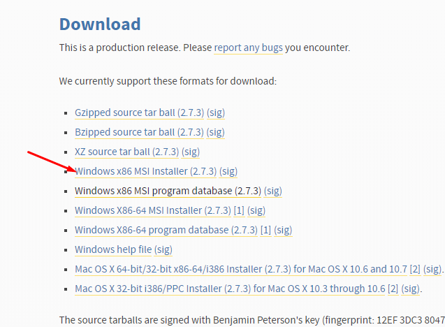
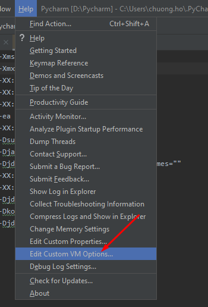
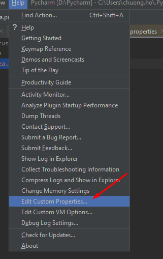
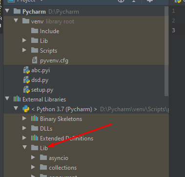

Chào mừng các bác đã ghé thăm blog của mình.😄

### Mục đích

Bài này viết với tiêu chí hướng dẫn cho các bác cài đặt **Pycharm** và  đưa môi trường này sử dụng nó vào viết mã hỗ trợ trong Dynamo với ngôn ngữ Python.

### Mở đầu 

Như các bác thấy đó, IDE có sẵn trong môi trường Dynamo thật sự mình nói không tệ, nhưng để hỗ trợ với người mới hoặc người viết thường xuyên thì việc này hơi túng.Lí do ở đây là gì? Chính là việc gợi ý viết các đoạn mã khá củ chuối.Ở bản 2.0 trở lên thì ra còn thấy cập nhật thêm một số tính năng nhỏ mà thôi, vậy nên mói lòi ra cái chuyện phải sử dụng IDE bên ngoài để viết mã.
Ở bài viết này mình chỉ đề cập dến Pycharm.Nếu các bác muốn xem cách sử dụng với Visual Studio Code thì các bác có thể xem bài viết mình đã viết rồi ở <a href="https://chuongmep.com/Autocomplete-stubs-for-common-IronPython-NET-libraries/" target="_blank">đây</a> 

### Cách thực hiện
Đầu tiên tất nhiên là mình sẽ phải tải Pycharm về rồi, công việc rất đơn giản , các bác chỉ việc vào trang chủ ở <a href="https://www.jetbrains.com/education/download/download-thanks-pce.html" target="_blank">đây</a> tải về mà thôi.Mình khuyến nghị các bác sử dụng bản Edu vì nó hơn một bậc so với bản cộng đồng.Nếu các bác muốn tải bản đó thì cũng ko sao hết nha.

Tiếp theo là cài đặt python phiên bản 2.7.3 nhé, phải là phiên bản này chứ 3 chấm trở lên viết chưa được các bác ạ, hiện tại cái autocomplete ở thời điểm này chạy ổn định và hỗ trợ cho bản này là tối ưu nhất, bản cao hơn vẫn chưa thể sử dụng được hết tính năng.Cài đặt cũng rất đơn giản, các bác nhớ chọn phiên bản đúng mà cài nhé.Đường dẫn liên kết mình để ở <a href="https://www.python.org/downloads/release/python-273/" target="_blank">đây</a> .Cài bản MSi cho gọn nhé các bác.

Vậy là được rồi , giờ mình sẽ vào cài đặt thêm một vài thứ nữa.Các bác mở Pycharm lên, cài đặt lại mục ReservedCodeCacheSize=1000m
Mục đích để tăng lưu trữ bộ nhớ cache vì cái thư viện mình sắp đưa vào nó sẽ rất nặng vì quá nhiều thư viện trong đó, bộ nhớ cache mặc định tải không nổi.

Tiếp đến là chỉnh thêm idea.max.intellisense.filesize = 999999

Cuối cùng mình chép thư viện IronPython Autocomplete vào từ <a href="https://chuongmep.com/Autocomplete-stubs-for-common-IronPython-NET-libraries/" target="_blank">bài</a>  mình đã hướng dẫn trước vào mục Lib của External Libraries

### Mở rộng
- Vấn đề lỗi với mã hiện tại còn rất nhiều vấn đề để nói nhưng cách sử dụng đến hiện tại là được đến đó rồi, mình cứ sử dụng thôi, hi vọng team Dynamo trong thời gian tiếp theo sẽ nâng cấp đang kể IDE, nói cho các bác vui vậy thôi chứ còn lâu lắm :D
- Nếu mình nói như bài viết thì người mói chắc sẽ nhiều chỗ thắc măc, nên mình đã quay lại video hướng dẫn đoạn sau khá rườm rà cho các tại <a href="https://www.youtube.com/watch?v=ltMOD4JAxec" target="_blank">đây</a> .Nếu mà còn thấy lỗi gì thì báo cáo bên dưới bình luận bằng Telegram nhé, mình sẽ trả lời các bác.

### Tổng kết

Đại dịch virus corona đang hoành hành tại thời điểm này , các bác hãy bảo vệ cá nhân và trong thời gian ở nhà nên học thêm nhiều cái mới , cuối cùng mình chúc bác thực hiện thành công.Cám ơn các bác đã ghé thăm blog và đọc bài viết của mình.
### Tham khảo :

<a href="https://forum.dynamobim.com/t/add-dll-reference-to-get-the-intellisense/12829" target="_blank">Dyanmo Forum</a> 