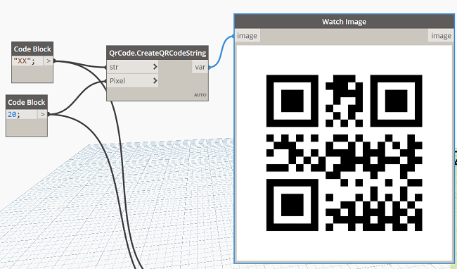
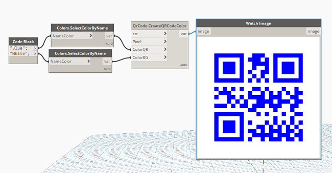
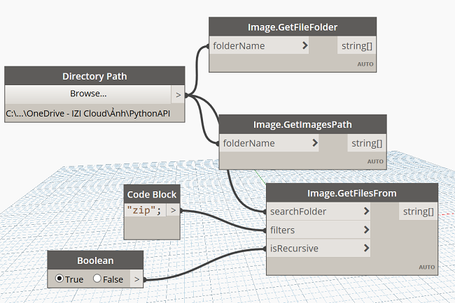
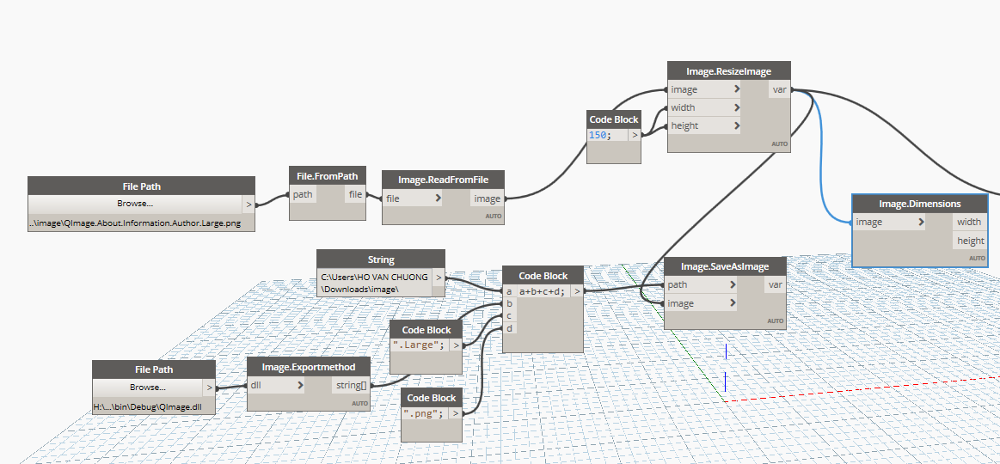
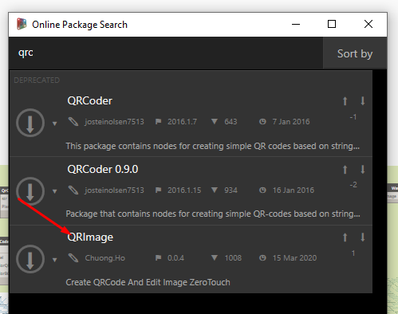

Chào mừng các bác đã ghé thăm blog của mình.😄

### Tại sao lại có bài viết này ?

- Câu chuyện được bắt đầu từ một việc củ chuối mình hỏi trên diễn đàn đó là việc tạo ra các Icon hàng loạt đóng gói cho lập trình viên, khi họ muốn một mớ hình ảnh của mình được sắp xếp gọn gàn theo tên quy định.Đó chính là việc đặt tên ảnh đóng gói bao gồm `NameSpace.Class.Method.Size.png`.
- Không những thế còn hàng loạt ảnh to nhỏ với kích thước 128x128 và 32x32 nữa cơ.
- Mình chợt nhận ra việc làm cái công việc này cho hàng trăm node mình viết ra vô cùng lâu.
- Trong cái đêm tức tối ấy,chợt một tia sáng tự động quy trình này loé lên trong đầu mình.Cũng vì mình lười ngồi đi gõ qua gõ lại như vậy nên mình đã giành thời gian ra một buổi tối để viết sơ cua ra cái package này cho các lập trình viên có sự bực tức như mình.Và sau đây mình sẽ điểm qua một số tính năng mà gói này có thể mang lại cho các bác 

### Tạo QR Code

Lí do mình chèn thêm tính năng này vào vì trong quá trình làm mình thấy các gói QR trên server Dynamo thiếu thốn quá nên thôi tích hợp luôn cho rồi hehe 
- Tạo QrCode đơn giản truyền vào tham số một chuỗi.

- Tạo QrCode bổ sung với tuỳ chỉnh màu

### Đọc tập tin
- Đọc tệp này mục đích sử dụng cho lọc các đuôi tệp là hình ảnh, hoặc các bác có thể thêm vào điều kiện lọc tuỳ ý với ba node này.

### Tạo ảnh hàng loạt cho DynamoAPI

- với node tuỳ chỉnh là sẽ đọc các hàm mà các bác đã viết trong mã của mình để hệ thống lại và tạo hàng loạt các ảnh mới với tên và kích thước lấy ra từ trong dự án, mình không phải đi ngồi gõ lại từ cái đâu :D 

### Tải về

Gói này đã được mình xuất bản và các bác hoàn toàn có thể tìm kiếm trực tuyến để tải về

#### Mở rộng

- Mình đã viết một bài trên <a href="https://github.com/DynamoDS/Dynamo/wiki/Automatically-register-batch-icons-for-Zero-Touch" target="_blank">Wiki</a>  để hướng dẫn nhiều người dùng không gặp phải tình trạng như mình.
- Mã nguồn mở mình đặt tại <a href="https://github.com/chuong9x/QRImage" target="_blank">đây</a>  cho bác nào có ý tưởng nghiên cứu tiếp tục làm thêm.Hiện tại mình còn quá nhiều việc phải làm nên sẽ chưa thể nâng cấp gì thêm nữa.
- Gói mã nguồn được đóng gói cực kì đơn giản để sử dụng được hầu hết từ phiên bản Core 0.9-2.5  và phiên bản DynamoRevit 0.9-2.5.Nên có sửa thì các bác cũng phải lưu ý đến vấn đề quan trọng này nhé.
### Tổng kết
Với những chia sẻ như trên, hi vọng sẽ giúp được các bác trong những chuyện gặp phải hằng ngày của các bác như mình , biết đâu một ngày đó các bác lại có ý tưởng hay hơn mình và cùng ngồi lại chỗ này để thảo luận, cuối bài viết mình xin cảm ơn tất cả các bác đã ghé thăm và đọc bài viết trên blog của mình.Nếu có ý kiến hoặc góp ý, hãy để lại lời nhắn bên dưới bình luận mình sẽ bổ sung sửa lỗi.
### Tham khảo :
Hồ Văn Chương