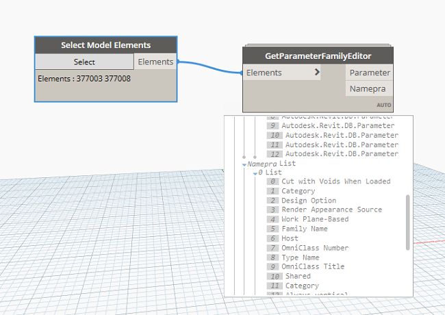

Chào mừng các bác đã ghé thăm blog của mình.😄

### Tại sao lại có bài viết này ?

- Câu chuyện này xuất phát từ một bà chị muốn nhờ kiểm tra tự động tham số share trong family edit, nghĩ mãi không ra nên có hỏi mình, mình cũng code vài dòng để góp ý nhưng không ngờ lại viết ra được luôn thư viện :D.

- Giải quyết vấn đề kiểm tra Family hàng loạt hoặc nâng cấp Family hoặc chèn thêm tham số cho Family chẳng hạn, các bác có thể nâng cáp code tuỳ theo ý tưởng của mình

### Thư viện khai báo

```
import clr

clr.AddReference('ProtoGeometry')
clr.AddReference('RevitAPI')
clr.AddReference("RevitServices")
from Autodesk.DesignScript.Geometry import *
from Autodesk.Revit.DB import *
from RevitServices.Persistence import DocumentManager
from RevitServices.Transactions import TransactionManager
```

### Khai báo một Document

```
doc = DocumentManager.Instance.CurrentDBDocument
```
### Chuyển đổi danh sách đầu vào sang List
```

def tolist(obj1):
    if hasattr(obj1,"__iter__"): return obj1
    else : return [obj1]

```
### Chuyển đối tượng về đối tượng Revit


```
fams = UnwrapElement(tolist(IN[0]))
name = []
parameter = []

```
### Khai báo một Class FamilyOption

```
class FamilyOption(IFamilyLoadOptions):
    def OnFamilyFound(self, familyInUse, overwriteParameterValues):
        overwriteParameterValues = True
        return True

    def OnSharedFamilyFound(self, sharedFamily, familyInUse, source, overwriteParameterValues):
        return True

```

### Xử lý thuật toán

```
try:

    for f in fams:
    	namepra = []
        family = UnwrapElement(f)
        #đóng một transaction đang mở.
        TransactionManager.Instance.ForceCloseTransaction()
        doc_family = doc.EditFamily(family.Symbol.Family)
        if doc_family != None:
            famman = doc_family.FamilyManager
            TransactionManager.Instance.EnsureInTransaction(doc_family)
            pra = doc_family.OwnerFamily.Parameters
            parameter.append(pra)
            for p in pra:
                namepra.append(p.Definition.Name)
            TransactionManager.Instance.TransactionTaskDone()
	name.append(namepra)
except Exception, ex:
    namepra.append(ex.message)

```


### Kết thúc đầu ra

```
OUT = parameter,name
```

### Kết quả 



### Mở rộng

- Phần này mình có ngẫu hứng làm một video hướng dẫn nên mọi người có muốn xem nó được viết như nào thì có thể xem tại <a href="https://www.youtube.com/watch?v=vTxzTM2m2do" target="_blank">Link</a>.

### Tổng kết

Với những chia sẻ như trên, hi vọng sẽ giúp được các bác trong những chuyện gặp phải hằng ngày của các bác như mình , biết đâu một ngày đó các bác lại có ý tưởng hay hơn mình và cùng ngồi lại chỗ này để thảo luận, cuối bài viết mình xin cảm ơn tất cả các bác đã ghé thăm và đọc bài viết trên blog của mình.Nếu có ý kiến hoặc góp ý, hãy để lại lời nhắn bên dưới bình luận mình sẽ bổ sung sửa lỗi.

### Tham khảo :
Hồ Văn Chương