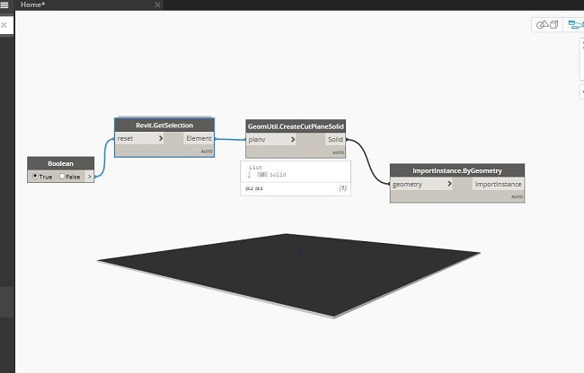
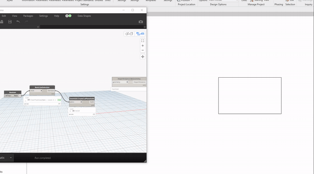

Chào mừng các bác đã ghé thăm blog của mình.😄

### MỞ đầu

Scripts dưới đây sẽ cho phép các bác tạo ra một Solid khớp với vùng Crop View mà ta đã định sẵn trong View đã chọn.Bài toán này là từ một người trong group hỏi mình việc đặt khối này không khớp với vị trí mong muốn.

### Scripts
``` csharp
public static Autodesk.DesignScript.Geometry.Solid CreateCutPlaneSolid(global::Revit.Elements.Element planv)
        {

            View planView = planv.InternalElement as View;
            BoundingBoxXYZ bbActiview = planView.get_BoundingBox(null);
            Plane planePlanView = planView.SketchPlane.GetPlane();
            PlanViewRange viewRange = (planView as ViewPlan).GetViewRange();
            double cutPlaneHeight = viewRange.GetOffset(PlanViewPlane.CutPlane);

            XYZ pt0 = new XYZ(bbActiview.Min.X, bbActiview.Min.Y, bbActiview.Min.Z);
            XYZ pt1 = new XYZ(bbActiview.Max.X, bbActiview.Min.Y, bbActiview.Min.Z);
            XYZ pt2 = new XYZ(bbActiview.Max.X, bbActiview.Max.Y, bbActiview.Min.Z);
            XYZ pt3 = new XYZ(bbActiview.Min.X, bbActiview.Max.Y, bbActiview.Min.Z);

            XYZ pt00 = ProjectOnto(planePlanView, pt0);
            XYZ pt11 = ProjectOnto(planePlanView, pt1);
            XYZ pt22 = ProjectOnto(planePlanView, pt2);
            XYZ pt33 = ProjectOnto(planePlanView, pt3);

            Line edge00 = Line.CreateBound(pt00, pt11);
            Line edge11 = Line.CreateBound(pt11, pt22);
            Line edge22 = Line.CreateBound(pt22, pt33);
            Line edge33 = Line.CreateBound(pt33, pt00);

            List<Curve> edges0 = new List<Curve>();
            edges0.Add(edge00);
            edges0.Add(edge11);
            edges0.Add(edge22);
            edges0.Add(edge33);

            CurveLoop baseLoop0 = CurveLoop.Create(edges0);
            List<CurveLoop> loopList0 = new List<CurveLoop>();
            loopList0.Add(baseLoop0);
            Solid preTransformSolid =
                GeometryCreationUtilities.CreateExtrusionGeometry(loopList0,
                    XYZ.BasisZ, cutPlaneHeight);
                    //transform
            Solid transformSolid = SolidUtils.CreateTransformed(preTransformSolid,
                bbActiview.Transform);

            return transformSolid.ToProtoType();
        }
        [IsVisibleInDynamoLibrary(false)]
        public static XYZ ProjectOnto(this Plane plane, XYZ p)
        {
            double d = plane.SignedDistanceTo(p);
            XYZ q = p - d * plane.Normal;

            return q;
        }
```

### Đưa vào môi trường trong Dynamo kiểm tra 



### Kết quả



### Tổng kết

Bài toán này gợi mở cho các bác tạo một khối Solid và đưa khối Solid về vị trí mong muốn, biết đâu sau khi đọc xong bài này các bác lại có ý tưởng gì đó cho công việc gì thì sao.Cuối cùng chúc các bác thực hiện thành công.Nếu có ý tưởng gì hày hãy bình luận bên dưới đóng góp mình sẽ bổ sung.Xin Cảm ơn các bác đã ghép thăm blog cuẩ mình.

### Tham khảo :
<a href="https://t.me/DynamoAPI" target="_blank">DynamoChat</a> 