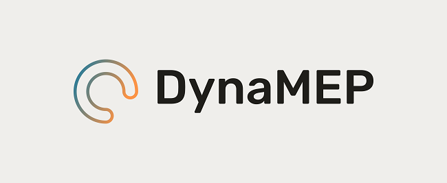
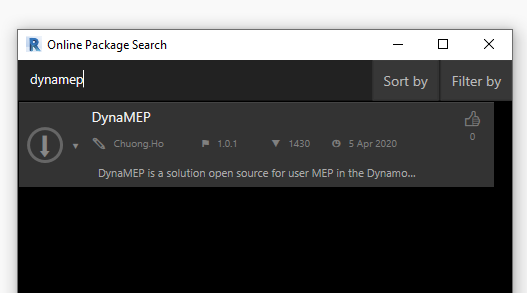

Chào mừng các bác đã ghé thăm blog của mình.😄

### MỞ đầu

Bài viết này mình sẽ giới thiệu cho các bác một gói hỗ trợ người dùng Dynamo mã nguồn mở mà mình viết gần đây.Cũng vì vấn đề phát sinh trong quá trình làm việc của mình với Dynamo nhận ra nhiều sự thiếu sót trong đó và đã viết lại một số thứ hỗ trợ tốt hơn , nhanh hơn vào công việc cho các bác, đặc biệt là đối với người dùng MEP.

### Gói hỗ trợ được gì ?

- Hỗ trợ các vấn đề với Family.
- Hỗ trợ với kết nối cấu kiện.
- Hỗ trợ Geometry(hiện tại bản 1.0.1 mình chưa ra nhiều nhưng sẽ cập nhật trong thời gian tới).
- Hỗ trợ Elements nâng cao trong các trường hợp cần xử lý nằm ngoài gói .
- Hỗ trợ các phiên bản 2.0 trở lên đến phiên bản mới nhất hiện tại 2.5 trên Revit 2021.
- Hỗ trợ người dùng MEP.(Pipe,Duct,Connector,Insulation,Cable Trays,...)
- Hỗ trợ trích xuất dữ liệu PointCloud.
- Hỗ trợ xử lý Revit Model.
- Hỗ trợ làm việc với Các lỗi cảnh báo (Warning trong mô hình).
...
### Tải xuống 

- Hiện tại gói đã xuất bản lên hệ thống tìm kiếm và tải xuống của Dynamo, các bác có thể tìm kiếm với tên **DynaMEP** và tải về tại <a href="https://www.dynamopackages.com/" target="_blank">đây</a> hoặc tìm kiếm mở tải về mở rộng trong tìm kiếm Dynamo.

### Mở rộng 

- Vì hiện tại mình khá bận rộn với công việc hiện tại nên chưa thể hướnG dẫn chi tiết sử dụng, các bác có thể từ từ khám phá nhé, mình sẽ bổ sung từ từ để hoàn thiện gói hỗ trợ người dùng này tốt nhất có thể.
- Gói này cho phép phân phối lại miễn là các bác không thay đổi chỉnh sửa nội dung tác giả.

### Tham khảo :
Hồ Văn Chương