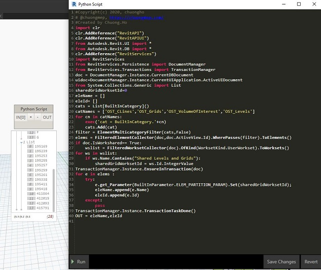

Chào mừng các bác đã ghé thăm blog của mình.😄

### Mở đầu

Bài viết này mình viết ra để ghi lại một câu hỏi của A Thiện từ <a href="https://www.facebook.com/groups/RACVN/" target="_blank">Revit API Community Vietnam</a> đó là muốn gán những workset tự động cho danh sách đối tượng có trong mô hình. Ví dụ Grid và Levels sẽ đc gán tự trong workset : `Share Levels and Grids`. Nhưng viết bằng ngôn ngữ Python.Cùng xem cách viết của mình giải quyết của mình với mã như nào nhé.

### Thư viện mẫu sử dụng 
```
#Copyright(c) 2020, chuongho
# @chuongmep, https://chuongmep.com/
#Created by Chuong.Ho
import clr
clr.AddReference("RevitAPI")
clr.AddReference("RevitAPIUI")
from Autodesk.Revit.UI import *
from Autodesk.Revit.DB import *
clr.AddReference("RevitServices")
import RevitServices
from RevitServices.Persistence import DocumentManager
from RevitServices.Transactions import TransactionManager
doc = DocumentManager.Instance.CurrentDBDocument
uidoc=DocumentManager.Instance.CurrentUIApplication.ActiveUIDocument
from System.Collections.Generic import List
```
### Lấy về đỐi tượng muốn set 
```
sharedGridWorksetId=0
eleName = []
eleId= []
cats = List[BuiltInCategory]()
catNames = ['OST_CLines','OST_Grids','OST_VolumeOfInterest','OST_Levels']
for cn in catNames:
	exec('cat = BuiltInCategory.'+cn)
	cats.Add(cat)
filter = ElementMulticategoryFilter(cats,False)
elems = FilteredElementCollector(doc,doc.ActiveView.Id).WherePasses(filter).ToElements()
```

### Lấy ra danh sách các workset 
```
if doc.IsWorkshared== True:
    try:
    	wslist = FilteredWorksetCollector(doc).OfKind(WorksetKind.UserWorkset).ToWorksets()
    except:
    	pass

```
### Đặt điều kiện cho workset 

```
for ws in wslist:
    if ws.Name.Contains("Shared Levels and Grids"):
        sharedGridWorksetId = ws.Id.IntegerValue
```
### Set Workset và xuất kết quả 

```
TransactionManager.Instance.EnsureInTransaction(doc)
for e in elems :
    try:
    	e.get_Parameter(BuiltInParameter.ELEM_PARTITION_PARAM).Set(sharedGridWorksetId);
    	eleName.append(e.Name)
    	eleId.append(e.Id)
    except:
    	pass
TransactionManager.Instance.TransactionTaskDone()
OUT = eleName,eleId
```

### Kết quả 


### Tổng kết

Tình trạng hiện nay dịch Covid19 đã cướp đi công việc nhiều người, đặc biệt là những người đang buôn bán dạo đâu đó trên khắp các vỉa hè và lề đường, nếu các bác thấy bài viết hay hãy mua và ủng hộ họ một ly nước hoặc một gói quà nhé.Cám ơn các bác  đã ghé thăm và đọc bài trên blog của mình.

### Tham khảo :
<a href="https://forums.autodesk.com/t5/revit-api-forum/set-element-workset/m-p/7714234#M28096" target="_blank">RevitAPI Forum</a> 